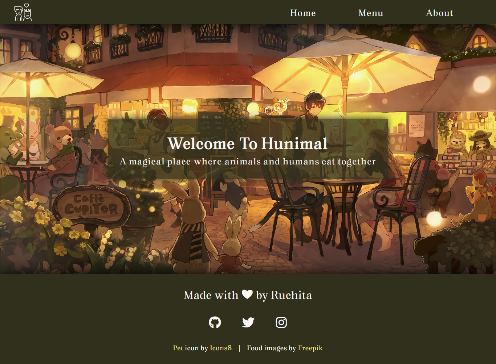
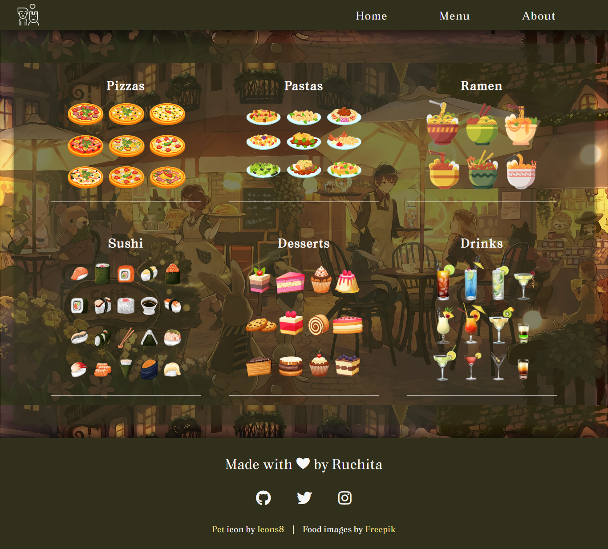

# Restaurant Page
Restaurant Page built using HTML, CSS, Javascript, and Webpack

## Learnings
- History of javascript (this helped get a clear idea of things)
- npm basics
- ES6 modules
- Webpack
    - Basics
    - Asset Management
    - Output Management
    - Development (watch mode, webpack-dev-server, and source maps)

## Roadmap
- Do more categorization of food items on the menu page
- Show available offers on the home page

## Preview

## Demo
👉 [Live Demo](https://ruchita1010.github.io/restaurant-page)